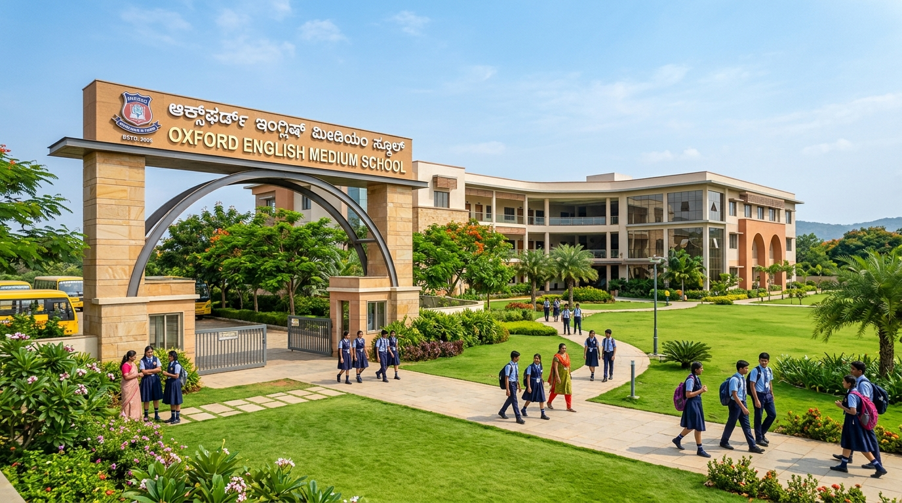

# Oxford English Medium School - Bukkapatna (572115) 🏫✨

Official modern web portal for **Oxford English Medium School, Bukkapatna - 572115** (Sira Taluk, Tumakuru District, Karnataka).



---

## 🌟 Key Highlights & Features

- 📢 **Live Notice Board & Announcement Ticker**: Breaking circulars for Admissions, Examinations, and Cultural fests.
- 🎓 **Academic Pathways**: Comprehensive Montessori/Kindergarten, Primary, Middle School, and High School / SSLC (Classes 9 & 10) curriculum.
- 🔬 **Campus Infrastructure**: Digital Smart Classrooms, Composite Science Labs, Computer & AI literacy Lab, Sports Arena, and 24/7 CCTV & RO water.
- 🚌 **Safe GPS-Tracked Transport**: Network covering Bukkapatna, Tavarekere, Sira Town, Chelur, Borasandra, Hagalavadi, and surrounding villages.
- 💰 **Interactive Fee & Transport Estimator Tool**: Real-time breakdown of tuition, smart class, and route transport fees with 3-term installment schedules.
- 📝 **Online Admission Application Portal**: Instant registration with auto-generated registration tokens (`#OEMS-XXXXXX`) and printable acknowledgement slip.
- 🖼️ **Interactive Photo & Video Gallery**: Full-screen lightbox viewer for campus events, sports days, and cultural celebrations (*Samskruthi*).
- 🏆 **Student Hall of Fame**: 100% SSLC board distinctions, state karate medals, and district science exhibition winners.
- 💬 **WhatsApp Instant Inquiry & Google Maps Directions**: Quick click-to-chat and turn-by-turn navigation.
- 🌐 **Bilingual Support**: Instant switch between English and Kannada (ಕನ್ನಡ).

---

## 📂 Project Structure

```text
oxford-school-bukkapatna/
├── assets/
│   └── images/
│       ├── campus_hero.jpg
│       ├── classroom.jpg
│       ├── cultural.jpg
│       └── sports.jpg
├── index.html        # Main HTML5 semantic page
├── style.css         # Modern design tokens & responsive styling
├── app.js            # Interactive calculators, modals & handlers
└── README.md         # Documentation
```

---

## 🚀 How to Run Locally

1. Clone or download the repository:
   ```bash
   git clone https://github.com/Eshwarkota47/Oxford_school.git
   cd Oxford_school
   ```

2. Open `index.html` in any modern web browser or start a local server:
   ```bash
   # Using Python
   python -m http.server 8080

   # Using Node / npx
   npx serve .
   ```

3. Open your browser at `http://localhost:8080`.

---

## 📍 Location Coordinates

- **Institution**: Oxford English Medium School
- **Address**: Main Road, Near Bus Stand, Bukkapatna - 572115, Sira Taluk, Tumakuru District, Karnataka
- **Recognition**: Govt. of Karnataka Recognised Co-Educational English Medium School
- **Contact**: +91 94482 15689 / +91 98450 78214
